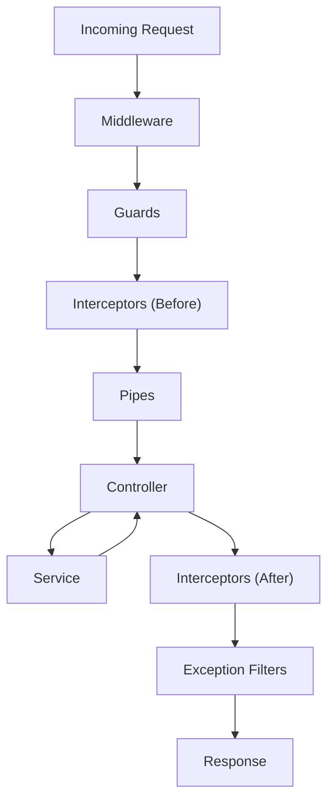
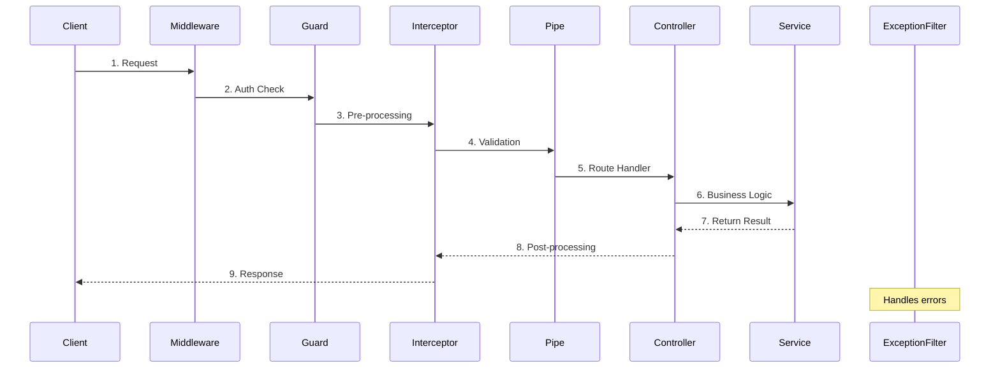

# nestjs 기본

## nestjs Request Life Cycle

### 상세 흐름 (Sequence Diagram)

### 각 단계 설명

| 순서 | 구성요소                  | 역할                            |
| ---- | ------------------------- | ------------------------------- |
| 1    | **Middleware**            | 요청/응답 변환, 로깅, CORS 등   |
| 2    | **Guards**                | 인증/인가 (CanActivate)         |
| 3    | **Interceptors (Before)** | 요청 전처리, 로깅 시작          |
| 4    | **Pipes**                 | 데이터 변환, 유효성 검증        |
| 5    | **Controller**            | 라우트 핸들러 실행              |
| 6    | **Service**               | 비즈니스 로직 처리              |
| 7    | **Interceptors (After)**  | 응답 후처리, 캐싱               |
| 8    | **Exception Filters**     | 에러 처리 (전 과정에서 발생 시) |
